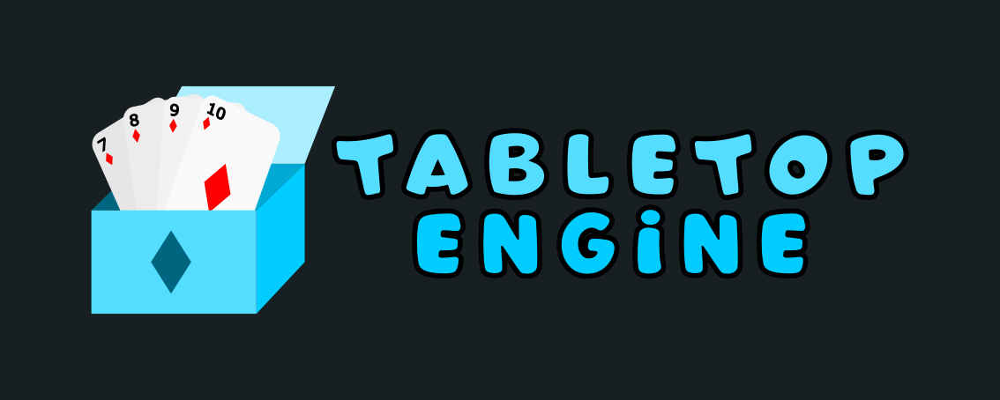

# What is Tabletop Engine?

Tabletop Engine is a cross-platform multiplayer customizable virtual tabletop that connects you and your friends to beloved tabletop games!

This README will be updated when the link for the early access alpha is ready.

> **NOTE:** This product is still in early development, please submit issues as you find them, as well as feature requests. I am eager to make Tabletop Engine work as smooth as possible.

## Comes with many possibilities by default!

The default tabletop suite includes playing cards, poker chips, and much more, allowing for a great experience right out of the box! Not only that, [custom tabletops](#build-tabletops-through-scripting) are supported, as well!

## Play with as many people as you'd like!

Multiplayer sessions support as many people as the network speed would allow, all through peer-to-peer connections! Connect by creating a room code, and sending the room code to your friends!

## Multiplatform and Cross Platform!

Tabletop Engine supports the following six platforms:

* Windows - Native support coming in `1.0`
* MacOS - Native support coming in `1.0`
* Linux - Native support coming in `1.0`
* iOS - Native support coming in `1.0`
* Android - Native support coming in `1.0`
* Web

You can play multiplayer between these devices as desired, there are no limitations!

## Build tabletops through scripting!

Tabletop engine supports scripting through the built-in `Board Builder`. Import images for game pieces, and program your tabletop using `GDScript`, a python-like language!

> **NOTE:** Documentation is still being worked on for the scripting functionality of Tabletop Engine's Board Builder.

> **NOTE:** Please note that the API for scripting is subject to significant change between now and the first major release `1.0`. Configurations made between now and `1.0` will need to be upgraded to each new modification of the API until the solification of the API in the first major release. From then on, there will be backwards compatibility support for configurations.

## Contributing

Currently, the documentation and default configurations are open to being contributed to! Make a PR with any suggested changes!

If you are not coding inclined, then try out the project, and click "submit feedback" in-game to be taken to our issues page! (Or, just click "issues" near the top of the GitHub page)